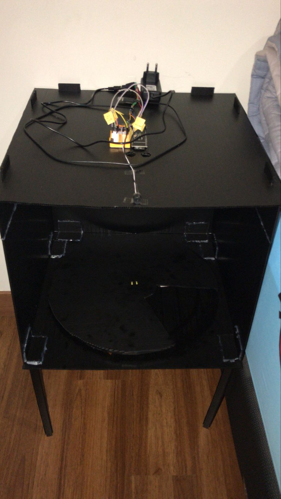
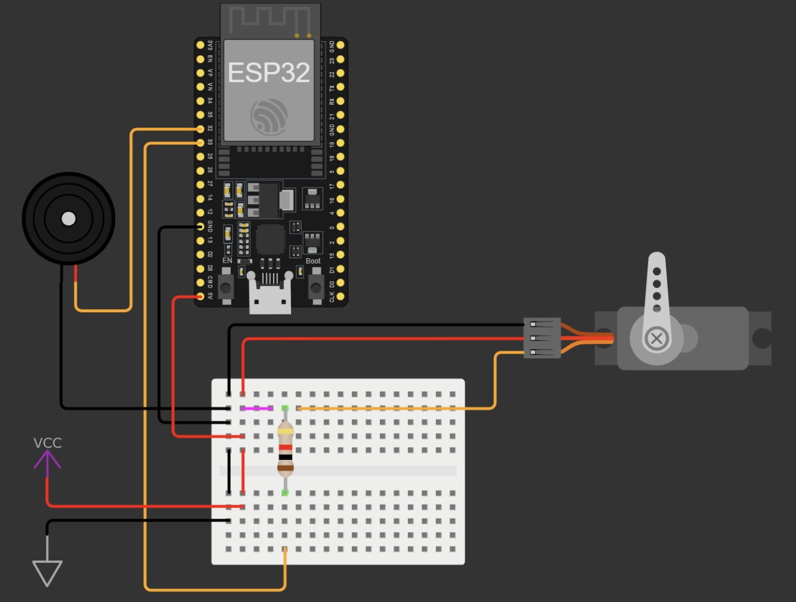

GOLDEN TRASH

an AI powered dumpster that uses trash classification for inferencing with a YOLOv5 model and an embedded system with EPS32

Guide to setup your own device.
1. Get building your own chamber !!!

2. Develop the circuit

3. Setup the server
    A. To setup the server, open up cmd and cd into the "Python Websocket server" folder.

    B. Makesure to download all requirements with "pip install -r requirements.txt" 
        you can download it with virtual environments like Anaconda or venv or download locally  using that command

    C. create new .env file to this exact folder. Copy the .env.template templates and paste it to the .env and configure the environment variables. After you configure which port, configure the port's access in firewall. 
        * Configure port access in windows firewall 
            - open Windows Defender Firewall with Advance Security 
            - Make an inbound rule for port WEBSOCKET_AND_HTTP_PORT that you used for the server, with the connection type TCP 

    D. make sure to get the yolov5.pt models by download / cloning the yolov5 project from github "https://github.com/ultralytics/yolov5.git" or directly downloading the .pt file from the github. Our tests runs on yolov5s.pt model.

    E. put the .pt file on the same hierarchy / directory as the main.py file

    F. Check the current device's IP address which is acting as the server with the command "ipconfig" in the cmd, save the ip address for later.

4. Open the "Main_AutoTrashcan_Project" with PlatformIO to automatically configure the microcontroller environment (Platformio.ini)

5. Setup the microcontroller program
    A. From the opened directory, go inside the "lib" folder and into the "conf" folder (./lib/conf). In this file you will meet a lot of configuration variables. Configure the conf.h file with your own credentials as necessary. (It is recommended to only configure the environment variables.)
        * for the ip address, we use the address got from the command entered on the server before, match the ip with this ip parameter inside the conf.h file.
        * for the port, we use the port number that you used for the server, match the port number with the port inside the .env file you have created before.
        * for the wifi_ssid, fill in with your wifi's name or ssid
        * for the wifi_password, fill in with your wifi's password
        * this wifi credentials must match the server's connected wifi instance (same local connection)

    B. The port and websocket variables have to be the same as the python server device's credentials.

    C. ATTENTION !!!
        I. Connect the server to the same local wifi with the microcontroller.
        II. The IP of the server's device is the SERVER_STATIC_IP variable.
        III. The port is the same with the python server's port.
        IV. The route is the server's route (It is recommended to not change this.)
        V. The WEBSOCKET_HOST_NAME is for mDNS, but it is probably not needed (still works because of the static ip).

    D. To run, CTRL+SHIFT+P and search for "PlatoformIO: New Terminal".

    E. Plug in your devboard.

    F. Run "pio run -t clean" to clean the build.

    G. Run "pio run -t erase" to erase the build inside the devboard. (remove the program inside the mc)

    H. Run "pio run -t upload" to upload the build to the chip while simultaneously doing compiling and building.

    I. Run "pio run -t monitor" to watch the code's output, where it prints to monitor the program running.

6. After you flashed the chip with the program, now unplug it.

7. Run the server with the command "python main.py" entered in the comand line on your server.

8. Open the local webserver link that's provided from the CLI

9. Plug in the device using powerbrick (or with usb connection)

10. If connected successfuly you will hear a bleeping noise.
